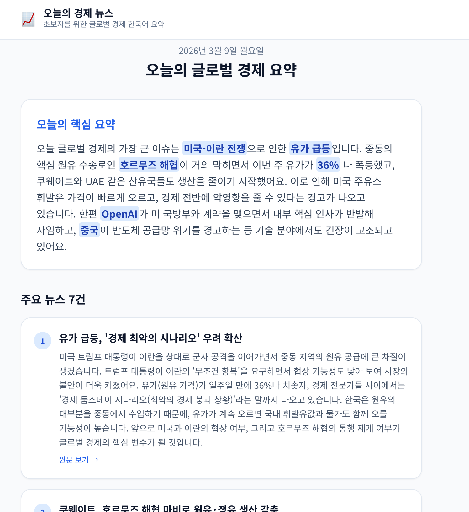
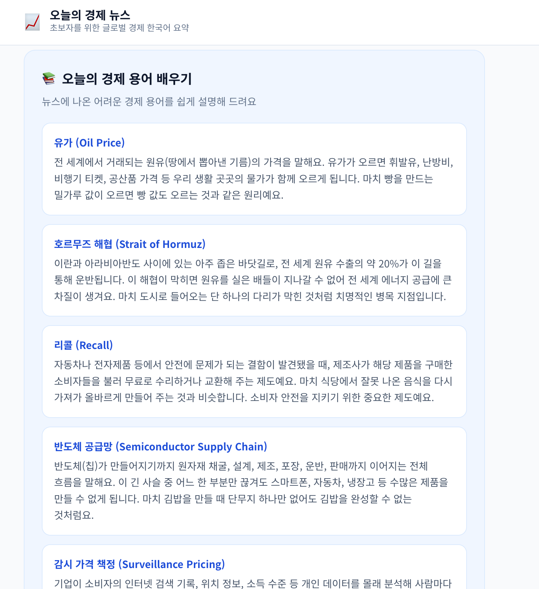

# 매일 아침 경제 공부 📰

글로벌 경제 뉴스를 매일 아침 8시에 한국어로 요약해서 이메일로 보내주는 웹사이트입니다.
경제를 처음 공부하는 분들도 쉽게 이해할 수 있도록 AI가 뉴스를 번역하고 설명해 드립니다.

**🔗 배포 링크: [https://econ101-weld.vercel.app/](https://econ101-weld.vercel.app/)**

## 스크린샷

| 뉴스 요약 | 경제 용어 학습 |
|-----------|--------------|
|  |  |

## 주요 기능

- **매일 아침 이메일 발송** — 매일 08:00 KST에 글로벌 경제 뉴스 요약본 자동 발송
- **한국어 AI 요약** — Claude AI가 영문 뉴스를 쉬운 한국어로 번역·설명
- **경제 용어 학습** — 뉴스에 등장한 어려운 경제 용어를 초보자도 이해할 수 있게 풀어서 설명
- **웹 대시보드** — 이메일 외에도 웹사이트에서 오늘의 뉴스를 바로 확인 가능

## 기술 스택

| 역할 | 기술 |
|------|------|
| 프레임워크 | Next.js 14 (App Router, TypeScript) |
| 스타일링 | Tailwind CSS 3 |
| 뉴스 수집 | NewsAPI (`category=business&country=us`) |
| AI 요약 | Anthropic Claude (`claude-sonnet-4-6`) |
| 이메일 발송 | Resend |
| 배포 | Vercel (Cron Job) |

## 프로젝트 구조

```
app/
  layout.tsx              # 루트 레이아웃 (Noto Sans KR 폰트)
  page.tsx                # 메인 페이지 (서버 컴포넌트, ISR 1시간)
  globals.css
  api/send-digest/
    route.ts              # 크론 엔드포인트 (GET, CRON_SECRET 인증)
lib/
  news.ts                 # fetchEconomicNews() → RawArticle[]
  claude.ts               # generateKoreanDigest() → KoreanDigest
  email.ts                # sendDigestEmail()
vercel.json               # 크론 스케줄 설정 (23:00 UTC = 08:00 KST)
```

## 시작하기

### 1. 환경 변수 설정

`.env.local` 파일을 생성하고 아래 값을 입력하세요:

```env
NEWS_API_KEY=your_newsapi_key
ANTHROPIC_API_KEY=your_anthropic_key
RESEND_API_KEY=your_resend_key
RESEND_FROM=noreply@yourdomain.com
RESEND_TO=you@example.com
CRON_SECRET=your_random_secret
```

### 2. 설치 및 실행

```bash
npm install
npm run dev
```

### 3. 이메일 발송 테스트

```bash
curl -H "Authorization: Bearer $CRON_SECRET" http://localhost:3000/api/send-digest
```

## 배포 (Vercel)

1. GitHub에 push 후 Vercel에서 프로젝트 import
2. Vercel 프로젝트 설정에서 환경 변수 등록
3. `vercel.json`의 크론 설정(`0 23 * * *`)에 따라 매일 23:00 UTC(08:00 KST)에 자동 실행
